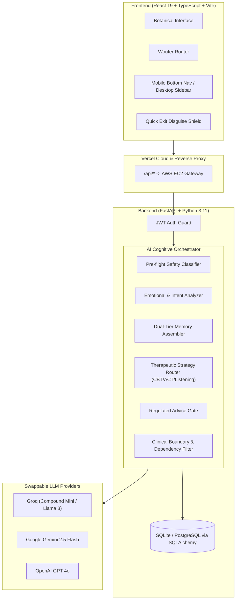

<div align="center">

# 🌿 MANAS — AI Mental-Health & Therapeutic Companion

> **A mind that makes room. A companion that holds context gently and stays beside the pace you set.**

[](https://manass-ai.vercel.app/)
[](https://github.com/prathamc00/Manas-AI/pulls)
[](LICENSE)
[](https://fastapi.tiangolo.com)
[](https://react.dev)
[](https://www.typescriptlang.org/)
[](https://www.docker.com/)

<br />

[Live App **Launch**](https://manass-ai.vercel.app/) • [🤝 **Contribute**](#-open-for-contribution)

</div>

---

## 📖 About MANAS

**MANAS** (*Sanskrit: मानस — "Mind, Thought, Perception"*) is an engineered, evidence-informed mental-health AI companion. Unlike generic chatbots that rush to deliver unsolicited advice or hallucinate medical diagnoses, MANAS is designed with **structured psychological reasoning, independent crisis safety classification, dual-tier contextual memory (Inferred vs. Confirmed), and multi-strategy therapeutic routing.**

Built with an organic, calming **Botanical Serif** design philosophy, MANAS creates a private, unhurried space for emotional reflection and somatic regulation.

---

## ✨ Core Features

| Feature | Description |
|---|---|
| ** Multi-Strategy Therapeutic Router** | Dynamically adapts between **Active Listening**, **Socratic CBT**, **Acceptance & Commitment (ACT)**, **Somatic Grounding**, and **Practical Guidance**. |
| **Pre-Flight Crisis Safety Gate** | Multi-layer safety engine combining keyword heuristics and independent LLM safety classification. Instantly triggers localized emergency helplines (India 112/KIRAN/Tele-MANAS, US 988, UK 111, Canada 988). |
| **Dual-Tier Contextual Memory** | Segregates AI inferences into unconfirmed vs. user-confirmed notes. The user has full autonomy to accept, edit, or delete any contextual memory. |
| **7-Day Emotional Pulse Tracker** | Interactive daily check-ins logging mood, stress, and energy with longitudinal pulse charting. |
| **a Somatic Toolkit** | Real-time interactive **Box Breathing (4-4-4-4)** visualizer and **5-4-3-2-1 Sensory Grounding** exercise. |
| **Growth Notes & Goals** | Manage personal micro-commitments and therapeutic goals with strategy trackers. |
| **Quick-Exit Disguise (`Esc`)** | Single-keystroke privacy mask that instantly transforms the UI into a realistic business spreadsheet. |
| **Mobile-First Native Experience** | Ergonomic bottom navigation, smooth spring gestures, and safe-area notch handling. |

---

## 🏗️ System Architecture



---

## 🛠️ Tech Stack

### **Frontend**
- **Core**: [React 19](https://react.dev/), [TypeScript](https://www.typescriptlang.org/), [Vite](https://vitejs.dev/)
- **Routing**: [Wouter](https://github.com/molefrog/wouter) (Ultra-lightweight client-side routing)
- **Styling**: Vanilla CSS Design Tokens, [Tailwind CSS](https://tailwindcss.com/)
- **Animations**: [Framer Motion](https://www.framer.com/motion/) (Organic spring physics & scroll reveals)
- **UI Components**: [Radix UI](https://www.radix-ui.com/), [Lucide React](https://lucide.dev/), [Sonner](https://sonner.emilkowal.ski/)
- **Typography**: Google Fonts (*Playfair Display* & *Source Sans 3*)
- **Deployment**: [Vercel](https://vercel.com/) with serverless API rewrites

### **Backend**
- **Framework**: [FastAPI](https://fastapi.tiangolo.com/) (Asynchronous Python 3.11)
- **Database ORM**: [SQLAlchemy 2.0 Async](https://www.sqlalchemy.org/) + [Alembic](https://alembic.sqlalchemy.org/)
- **Data Stores**: SQLite (Local / Container) / PostgreSQL (Production)
- **Authentication**: JWT (JSON Web Tokens) with Argon2 / BCrypt password hashing
- **Containerization**: [Docker](https://www.docker.com/) & Docker Compose
- **Hosting**: **AWS EC2** (Ubuntu Server running Docker container on port 8001)

### **AI & Psychological Engine**
- **Providers**: [Groq](https://groq.com/) (Default: `groq/compound-mini`), [Google Gemini](https://ai.google.dev/), [OpenAI](https://openai.com/)
- **Prompt Engineering**: Dynamic multi-pass prompt assembly with dual-tier context injection and strict clinical boundary safeguards.

---

## 🚀 Quick Start Guide

### Prerequisites
- **Node.js** (v18.0 or higher)
- **Python** (v3.11 or higher)
- **Git**
- *(Optional)* **Docker & Docker Compose**

---

### 1. Clone the Repository
```bash
git clone https://github.com/prathamc00/Manas-AI.git
cd Manas-AI
```

### 2. Backend Setup
```bash
cd backend

# Create and activate virtual environment
python -m venv .venv
# On Linux/macOS:
source .venv/bin/activate
# On Windows:
.venv\Scripts\activate

# Install Python dependencies
pip install -r requirements.txt

# Create .env configuration
cp .env.example .env
```

Configure your `backend/.env` file:
```env
AI_PROVIDER=groq
GROQ_API_KEY=your_groq_api_key_here
GROQ_MODEL=groq/compound-mini
SECRET_KEY=your_jwt_secret_key_here
DATABASE_URL=sqlite+aiosqlite:///./data/manas.db
CORS_ORIGINS=http://localhost:5173,http://127.0.0.1:5173,https://manass-ai.vercel.app
```

Start the backend server:
```bash
python run.py
```
> Backend runs at `http://127.0.0.1:8000` • Interactive API Docs at `http://127.0.0.1:8000/docs`

---

### 3. Frontend Setup
```bash
cd ../frontend

# Install dependencies
npm install

# Start Vite development server
npm run dev
```
> Frontend runs at `http://localhost:5173`

---

### 🐳 Docker Setup (One Command)
```bash
docker compose up --build -d
```

---

## 🧪 Running Tests

Execute the comprehensive test suite covering safety classifiers, context assembly, and API endpoints:

```bash
cd backend
pytest -v
```

---

## 📂 Project Structure

```
Manas-AI/
├── backend/
│   ├── app/
│   │   ├── ai/
│   │   │   ├── providers/        # Groq, Gemini, OpenAI, and Mock providers
│   │   │   ├── context/          # Context assembler (history, memories, mood, goals)
│   │   │   ├── safety/           # Independent pre-flight crisis classifier
│   │   │   ├── therapy/          # CBT, ACT, Grounding, and Listening strategies
│   │   │   ├── advice/           # Regulated advice generator
│   │   │   ├── understanding/    # Intent & emotional tone analyzer
│   │   │   └── orchestrator.py   # Multi-pass cognitive pipeline coordinator
│   │   ├── api/                  # REST endpoints (auth, chat, sessions, memories, mood, goals)
│   │   ├── database/             # SQLAlchemy async models & database connection
│   │   └── schemas/              # Pydantic validation schemas
│   ├── Dockerfile
│   ├── docker-compose.yml
│   └── requirements.txt
│
├── frontend/
│   ├── public/                   # Botanical icons & SVG assets
│   ├── src/
│   │   ├── components/           # Reusable UI & Botanical illustration vectors
│   │   ├── contexts/             # Theme & session context providers
│   │   ├── hooks/                # Mobile detection & composition hooks
│   │   ├── lib/                  # API client & token persistence utilities
│   │   ├── pages/                # Landing, Auth (Login/Signup), Home (Companion Workspace)
│   │   ├── types/                # TypeScript interface definitions
│   │   ├── App.tsx               # Wouter router declaration
│   │   └── index.css             # Botanical design system tokens & responsive rules
│   ├── package.json
│   ├── vite.config.ts
│   └── vercel.json               # Vercel reverse proxy rewrite rules
│
├── PRD.md                        # Comprehensive Product Requirement Document
└── README.md                     # Project documentation
```

---

## 🤝 Open for Contribution

I warmly welcome contributions from the community! Whether you want to add new therapeutic modalities, improve safety classifications, enhance UI micro-interactions, or fix bugs, your help makes MANAS better for everyone.

### How to Contribute:

1. **Fork the Repository**:
   Click the **Fork** button at the top right of this repository.

2. **Create a Feature Branch**:
   ```bash
   git checkout -b feature/your-feature-name
   ```

3. **Make Your Changes**:
   Follow project conventions, maintain TypeScript safety on the frontend, and add test cases for backend features.

4. **Run Validation & Tests**:
   ```bash
   # Backend validation
   cd backend && pytest

   # Frontend build verification
   cd frontend && npm run build
   ```

5. **Commit Your Changes**:
   ```bash
   git commit -m "feat: add your descriptive feature commit message"
   ```

6. **Push and Open a Pull Request**:
   ```bash
   git push origin feature/your-feature-name
   ```
   Open a Pull Request on GitHub with a description of what was added or fixed.

---

## ⚠️ Clinical & Safety Disclaimer

**MANAS is an engineered AI companion designed for personal reflection, emotional exploration, and somatic mindfulness. It is NOT a licensed healthcare provider, medical device, or replacement for clinical psychotherapy, psychiatric treatment, or emergency crisis intervention.**

If you or someone you know is in acute distress or experiencing thoughts of self-harm, please reach out to emergency services immediately:
- **India**: Call **112** 
---

## 📄 License

This project is licensed under the **MIT License** — see the [LICENSE](LICENSE) file for details.

---

<div align="center">

Made with Lve and care for slower, more honest conversations.

[⬆ Back to Top](#-manas-ai-mental-health--therapeutic-companion)

</div>
